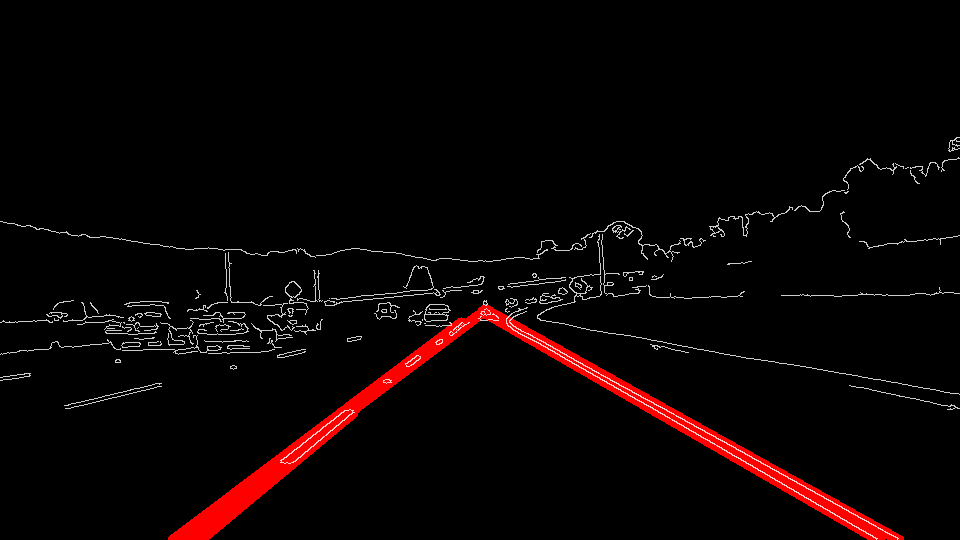

# **Finding Lane Lines on the Road** 

## Writeup Template

### You can use this file as a template for your writeup if you want to submit it as a markdown file. But feel free to use some other method and submit a pdf if you prefer.

---

**Finding Lane Lines on the Road**

The goals / steps of this project are the following:
* Make a pipeline that finds lane lines on the road
* Reflect on your work in a written report

[//]: # (Image References)

[image1]: ./examples/grayscale.jpg "Grayscale"

---

### Reflection

### 1. Describe your pipeline. As part of the description, explain how you modified the draw_lines() function.

My pipeline consisted of 5 steps:

1. Detect the Edges 
2. Apply a Mask
3. Detect the Lanes
4. Filter out irrelevant lines
5. Draw the lines

![solidWhiteCurves][test_images_output/solidWhiteCurves.jpg]

### 2. Identify potential shortcomings with your current pipeline

One potential shortcoming would be what would happen when ... 

When I ran the challenge problem, I noticed that when the yellow lane was on white pavement, the algorithm quite often lost it

Another shortcoming could be ...

### 3. Suggest possible improvements to your pipeline

One improvement would be to take into consideration the fact that each of the frames are related to the frames that surround it. To take advantage of that, if the lines predicted by the algorithm differ significantly from frame to frame, there's a pretty good chance that one of the lines isn't really a line.

Another improvement would be to merge close lines together. If there are multiple predicted lines for a single lane line, then we can take the average or use a single line to represent it.
